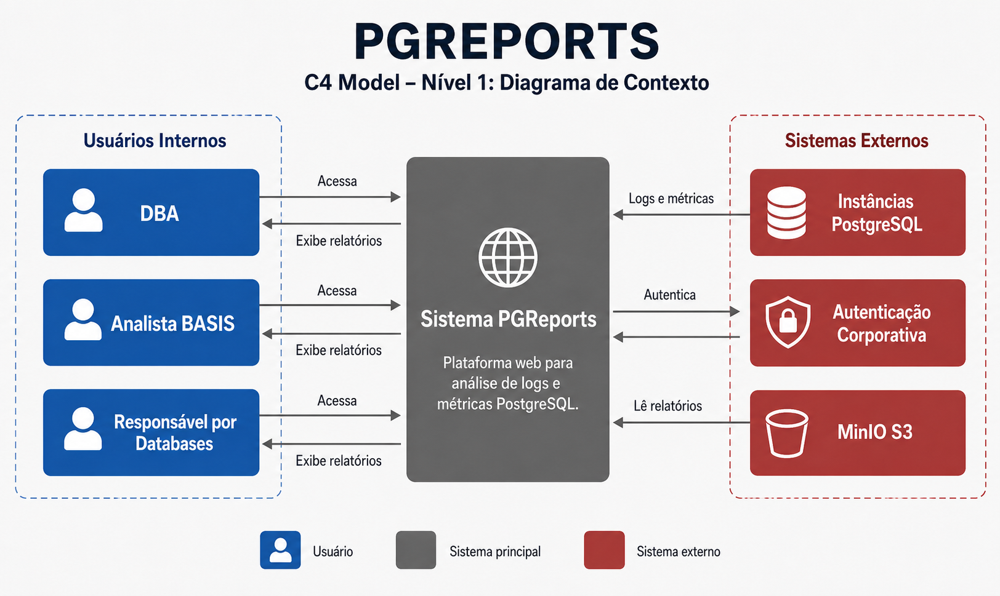
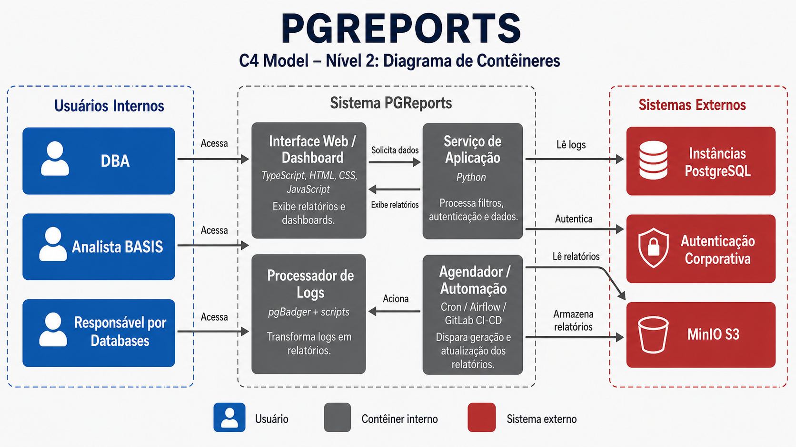
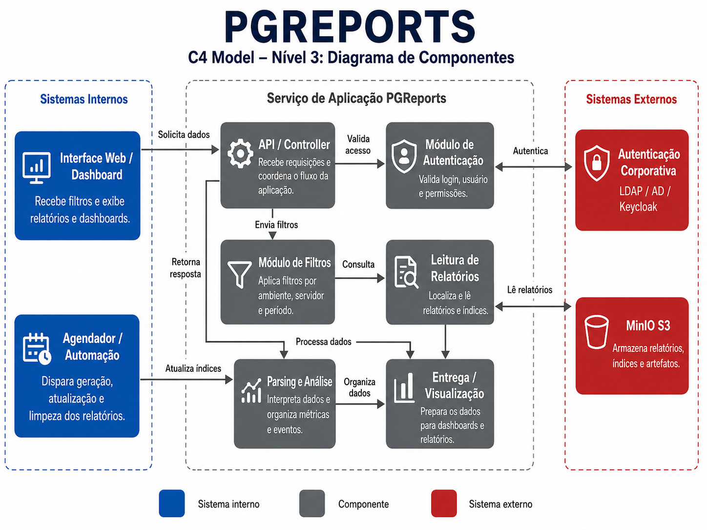
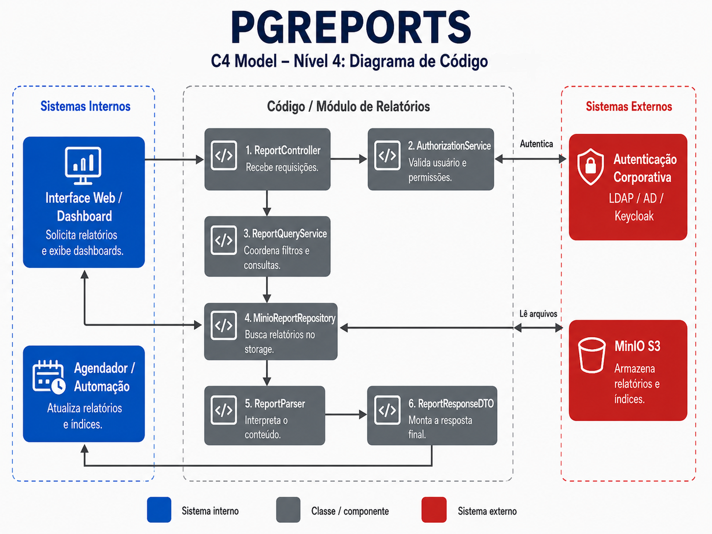
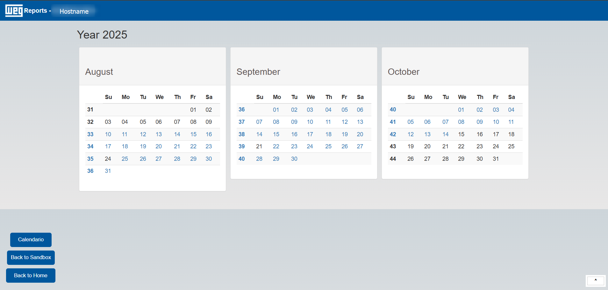
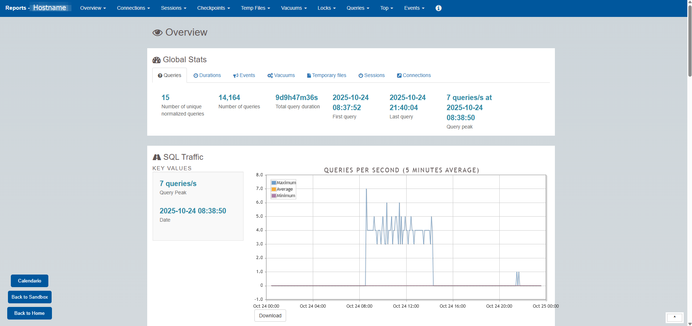
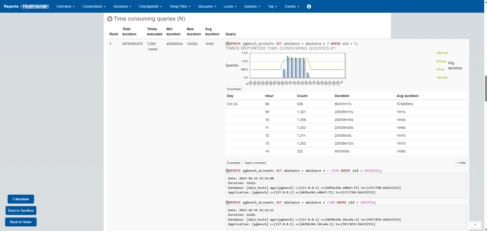

    

# Capa
- **Título do Projeto**: PGReports.
- **Nome do Estudante**: Nathan Cielusinski.
- **Curso**: Engenharia de Software.
- **Data de Entrega Inicial**: 30/11/2025.
- **Data de Entrega Final:** 24/06/2026.

# Resumo
O PGReports é uma aplicação web desenvolvida para auxiliar na análise de logs e métricas de desempenho de instâncias PostgreSQL dentro dos ambientes corporativos da WEG. O sistema centraliza e transforma dados complexos de logs em informações acessíveis, permitindo que DBAs e analistas identifiquem rapidamente gargalos, queries custosas e comportamentos atípicos. O projeto destaca-se por sua abordagem direta ao log cru *(raw log)*, possibilitando avaliações profundas e diagnósticos mais precisos. A aplicação visa otimizar o tempo de análise e aumentar a eficiência das equipes técnicas, tornando o processo de identificação e resolução de problemas mais ágil, visual e confiável.

## 1. Introdução
- **Contexto**: A aplicação PGReports foi desenvolvida para suprir uma necessidade interna da empresa WEG nas áreas de SAP BASIS (SAP Business Application Software Integrated Solution), suporte de infraestrutura e para auxiliar os colaboradores responsáveis por _bancos de dados_ que estejam ligadas à aplicações.
  
- **Justificativa**: Com a alta demanda de instâncias PostgreSQL surgindo, foi identificado o crescimento abundante destes ambientes gerenciados pela TI. Considerando problemas que se tornavam muito custosos e trabalhosos para identificar uma resolução cabível, o PGReports foi pensado e desenvolvido para auxiliar na avaliação final e, rapidamente, identificar os problemas destes _bancos de dados_.
  
- **Objetivos**: Facilitar a análise de DBAs, analistas e responsáveis por *databases* para identificar problemas em instâncias e bancos de dados Postgres internos da WEG.

## 2. Descrição do Projeto
* **Linha de Projeto**: O PGReports é uma aplicação web disponibilizada na rede interna da empresa WEG.
  
* **Tema do Projeto**: Uma aplicação que economiza tempo e facilita a visualização de dados e informações de nível mais profundo dos logs PostgreSQL.
  
* **Propósito e Uso Prático**: Quando ferramentas básicas de visualização e análise de dados, como Grafana, se tornam superficiais para a resolução de um problema, analistas devem atuar para identificar o gargalo ou a falha que resultou no problema encontrado. O PGReports surge, nesses casos, como uma ótima opção de análise, uma vez que trabalha diretamente com o _raw log_ (log puro e sem tratamento algum).

* **Público-Alvo**: O público alvo dessa ferramente são DBAs, analistas BASIS e os próprios responsáveis por bancos de dados dentro dos ambientes gerenciados pela T.I da WEG.

* **Problemas a Resolver**: Desperdício de tempo para encontrar situações atípicas, queries que estão sendo mais executadas, mais demoradas e mais custosas, no geral, para o servidor, assim como a identificação da aplicação e client responsável pela execução dessas queries. De maneira abrangente, o PGReports facilita na resolução destes problemas agrupando essas informações de forma prática com uma interface amigável ao usuário final.

* **Diferenciação/Ineditismo**: Trabalhar com o "log cru" de forma detalhada, profunda e direta para apresentar os dados em uma exibição prática e intuitiva.

* **Limitações**: Como o PGReports surgiu para suprir uma necessidade existente da empresa, abrangendo apenas ambientes gerenciados pela T.I. WEG, seu foco está voltado para a instância geral, o que não abrange a avaliação individual dos bancos de dados presentes nela. Vale ressaltar que a aplicação pode gerar insights positivos quanto à melhorias de aplicações e databases individuais, mas os reports não são voltados às _databases_, e sim à instância em que estes se localizam.

* **Normas e Legislações Aplicáveis**: O desenvolvimento e a operação do PGReports seguem diretrizes de conformidade técnica e de proteção de dados, assegurando que informações corporativas sejam tratadas com segurança e responsabilidade.
  - LGPD (Lei Geral de Proteção de Dados – Lei nº 13.709/2018):
O PGReports não coleta dados pessoais de usuários finais. Todos os logs processados são provenientes de servidores internos e possuem natureza técnica, não identificando pessoas físicas. Caso haja necessidade futura de integração com dados sensíveis.
  - ISO/IEC 27001 – Segurança da Informação: As práticas de controle de acesso, armazenamento seguro e versionamento seguem os princípios da norma ISO/IEC 27001, garantindo confidencialidade, integridade e disponibilidade das informações.
  - OWASP: O sistema foi projetado com base nas boas práticas de segurança de aplicações web, prevenindo riscos como injeção de código, falhas de autenticação e exposição indevida de dados.
  - Política Interna de Segurança WEG: O PGReports opera exclusivamente na rede corporativa, observando as políticas internas de TI e conformidade da WEG, com controle de acesso restrito a usuários autenticados e autorização hierárquica.

* **Métricas de Sucesso**: O sucesso do PGReports será avaliado pela eficiência e impacto direto nas operações de análise de dados da WEG. Entre os principais indicadores estão:
  - Redução do tempo de diagnóstico de falhas em bancos PostgreSQL.
  - Identificação de gargalos e queries ineficientes, prevenindo incidentes.
  - Aumento da produtividade das equipes técnicas, com centralização das informações.
  - Melhoria na performance das aplicações e no uso dos recursos do servidor.
  - Maior rastreabilidade em ações de usuários dos bancos de dados PostgreSQL.
  - Adoção interna crescente e feedback positivo dos usuários.

## 3. Especificação Técnica
Considerando e assegurando a conformidade com boas práticas de desenvolvimento web e segurança corporativa, os requisitos, arquitetura, design e considerações técnicas do PGReports foram pensados da seguinte forma:

### 3.1. Requisitos de Software
- **Requisitos Funcionais (RF)**:
  1. RF-001 — Geração de relatórios D-1:
      - O sistema deve gerar e disponibilizar os relatórios no modelo D-1, permitindo que os dados de um determinado dia sejam consultados a partir do dia seguinte.
  2. RF-002 — Processamento incremental:
      - O sistema deve processar os logs brutos gerados pelas instâncias PostgreSQL e produzir relatórios incrementais, evitando o reprocessamento desnecessário de dados já analisados.
  3. RF-003 — Consulta por calendário:
      - O usuário deve poder acessar relatórios diários e semanais por meio de um calendário interativo.
      - O calendário deve apresentar somente datas e períodos que possuam relatórios disponíveis.
  4. RF-004 — Classificação de eventos:
      - O sistema deve organizar e exibir os dados de acordo com categorias de eventos, incluindo:
        - erros;
        - checkpoints;
        - vacuums;
        - locks;
        - sessões;
        - tipos de queries;
        - demais eventos identificados nos logs.
  5. RF-005 — Dashboards e métricas:
      - O sistema deve exibir métricas e informações de desempenho em dashboards visuais.Entre as informações apresentadas devem estar:
        - tempo de execução das queries;
        - quantidade de execuções;
        - queries mais demoradas;
        - queries que mais consumiram tempo;
        - sessões identificadas;
        - eventos e períodos de maior atividade.
  6. RF-006 — Exportação de gráficos:
      - O usuário deve poder exportar ou baixar os gráficos disponibilizados nos relatórios em formato PNG.
  7. RF-007 — Controle de acesso:
      - O sistema deve restringir o acesso a usuários internos autenticados.
A autenticação deve utilizar o serviço corporativo definido para o projeto, como LDAP, Active Directory ou Keycloak.
      - As funcionalidades administrativas devem ser disponibilizadas somente para usuários autorizados.
  8. RF-008 — Retenção de relatórios:
      - O sistema deve permitir a configuração do período de retenção dos relatórios.
      - O período padrão deve ser de 90 dias, após o qual os relatórios e índices relacionados poderão ser removidos automaticamente.

- **Requisitos Não-Funcionais (RNF)**:
  1. RNF-001 — Desempenho:
      - O processamento dos logs deve ocorrer de forma incremental, reduzindo o tempo de execução e o consumo de recursos.
      - A aplicação deve evitar o reprocessamento completo dos arquivos sempre que houver apenas novos registros.
  2. RNF-002 — Usabilidade:
      - A interface deve ser intuitiva, responsiva e visualmente clara.
      - A navegação deve permitir que o usuário localize ambientes, servidores, períodos e relatórios sem precisar acessar diretamente os arquivos de log.
  3. RNF-003 — Segurança:
      - O acesso deve ser restrito à rede corporativa da WEG ou aos meios de conexão autorizados pela organização.
      - O sistema deve exigir autenticação para acesso aos relatórios.
      - Informações sensíveis presentes nos logs devem ser mascaradas sempre que aplicável.
      - Credenciais e segredos não devem ser armazenados diretamente no código-fonte.
  4. RNF-004 — Escalabilidade:
      - O sistema deve permitir a inclusão de novas instâncias PostgreSQL sem exigir alterações significativas na arquitetura.
      - O processamento de uma instância não deve impedir a geração de relatórios das demais.
  5. RNF-005 — Disponibilidade:
      - As rotinas de coleta, processamento e transferência devem ser executadas automaticamente em segundo plano.
      - Falhas de processamento devem ser registradas para permitir diagnóstico e reexecução.
      - As rotinas podem ser controladas por ferramentas de agendamento e orquestração, como Airflow, cron ou systemd, conforme a arquitetura adotada.
  6. RNF-006 — Compatibilidade
      - O sistema deve ser compatível com instâncias PostgreSQL 14 ou superiores, considerando as versões homologadas e testadas durante o projeto.
      - A compatibilidade deve considerar também o formato e as configurações dos logs utilizados pelo pgBadger.
  7. RNF-007 — Manutenibilidade:
      - Os scripts, configurações e componentes da aplicação devem ser versionados.
      - O código deve ser organizado de forma modular, facilitando correções e inclusão de novas funcionalidades.
      - As configurações específicas de cada ambiente devem ser mantidas separadas da lógica principal da aplicação.
  8. RNF-008 — Rastreabilidade:
      - As rotinas automatizadas devem registrar informações sobre início, término, duração, sucesso e falha das execuções.
      - Os registros devem permitir a identificação da instância, do período e do relatório processado.

- **Aderência aos Requisitos da Linha de Projeto**: O PGReports é uma aplicação Web que atende aos critérios obrigatórios desta linha de projeto:
  - Indexes dos reports desenvolvidos em HTML5, CSS3 e JavaScript (frontend).
  - Interface da aplicação desenvolvida em Typescript.
  - Utilização de scripts Python durante o seu ciclo.
  - Geração de relatórios e visualizações dinâmicas (componentes web responsivos).

### 3.2. Considerações de Design
- **Visão Inicial da Arquitetura**: A arquitetura do PGReports é dividida em quatro camadas principais:
  1. Coleta: As instâncias PostgreSQL geram os logs técnicos, atuando com os scripts e rotinas automatizadas que transferem os arquivos para o processamento. 
  2. Processamento: Parser dos logs (pgBadger) e estruturação dos dados em formato legível.
  3. Armazenamento: Organização dos relatórios em diretórios estruturados por data (ano/mês/semana/dia).
  4. Apresentação: Exibição dos resultados em uma interface web responsiva com gráficos dinâmicos e interativos.
    
- **Padrões de Arquitetura**: O projeto adota uma Arquitetura em Camadas combinada com o padrão MVC (Model–View–Controller):
  - Model: Responsável pela leitura e organização dos dados dos logs.
  - View: Camada de interface e dashboards web.
  - Controller: Lógica intermediária de negócio.

- **Modelos C4**:
  1. Nível 1 — Diagrama de Contexto do Sistema:
    - Objetivo:
      - Mostrar o PGReports de forma geral, sem entrar nos detalhes internos da aplicação, focando nos usuários e sistemas externos que se comunicam com a aplicação.

    - Sistema principal:
      - PGReports:
        - Aplicação web usada para transformar logs e métricas do PostgreSQL em relatórios mais fáceis de consultar.
        - Ajuda DBAs, analistas BASIS e responsáveis por databases a identificar gargalos, queries demoradas, eventos, locks e outros problemas.

    - Usuários:
      - DBA:
        - Consulta relatórios, dashboards e informações de desempenho das instâncias PostgreSQL.
      - Analista BASIS:
        - Usa os dados do PGReports para apoiar análises e chamados relacionados às aplicações.
      - Responsável por Databases:
        - Acompanha os ambientes e verifica queries, eventos e indicadores relacionados aos bancos sob sua responsabilidade.

    - Sistemas externos:
      - Instâncias PostgreSQL:
        - Geram os logs e métricas usados pelo PGReports.
      - Autenticação Corporativa:
        - Valida o acesso dos usuários internos por LDAP, AD ou Keycloak.
      - MinIO S3:
        - Armazena os relatórios, índices e demais arquivos gerados.

  

  2. Nível 2 — Diagrama de Contêineres:
    - Objetivo:
      - Mostrar as principais partes que formam o PGReports e a responsabilidade de cada uma.

    - Contêineres:
      - Interface Web / Dashboard:
        - Exibe calendário, overview, top queries, events, sessions, locks e outros relatórios visuais.
        - Desenvolvida com TypeScript, HTML, CSS e JavaScript.

      - Serviço de Aplicação:
        - Recebe as solicitações da interface, aplica filtros, valida acessos e entrega os dados para o frontend.
        - Desenvolvido principalmente em Python.

      - Processador de Logs:
        - Usa pgBadger, Python e Bash para transformar logs brutos do PostgreSQL em relatórios estruturados.

      - Agendador / Automação:
        - Usa Cron, Airflow, GitLab CI/CD e scripts para disparar geração, atualização, transferência e limpeza dos relatórios.

    - Armazenamento:
      - Bucket MinIO S3:
        - Guarda os relatórios processados, índices, gráficos e artefatos organizados por ambiente, servidor e data.

    - Sistemas externos:
      - Instâncias PostgreSQL:
        - Fornecem os logs que serão processados.

      - Autenticação Corporativa:
        - Valida os usuários que acessam a aplicação.

  

  3. Nível 3 — Diagrama de Componentes:
    - Objetivo:
      - Mostrar os principais módulos internos do PGReports, principalmente dentro do Serviço de Aplicação.

    - Componentes:
      - Módulo de Autenticação:
        - Valida login, perfil e permissão dos usuários.

      - Módulo de Filtros e Consulta:
        - Aplica filtros por ambiente, servidor, período, database, usuário, evento e tipo de query.

      - Módulo de Leitura de Relatórios:
        - Localiza e lê os relatórios armazenados no MinIO S3.

      - Módulo de Parsing e Análise:
        - Interpreta os arquivos processados e organiza os dados de overview, top queries, events, sessions, locks, checkpoints e vacuums.

      - Módulo de Visualização:
        - Prepara gráficos, tabelas, indicadores e demais informações que serão exibidas na interface.

      - Módulo de Agendamento:
        - Controla as rotinas automáticas de geração, atualização e limpeza dos relatórios.

      - Módulo de Auditoria e Erros:
        - Registra acessos, falhas de leitura, erros de processamento e ações importantes do sistema.

  

  4. Nível 4 — Diagrama de Código:
    - Objetivo:
      - Mostrar os detalhes de implementação de um componente específico do PGReports.

    - Implementações:
      - TypeScript:
        - Usado na interface, navegação, filtros, componentes visuais e comunicação com o backend.

      - Python:
        - Usado no serviço de aplicação, leitura de relatórios, automações e integração com o MinIO.

      - Bash / Shell Script:
        - Usado nas rotinas de coleta, execução do pgBadger, transferência e limpeza de arquivos.

      - SQL:
        - Usado em consultas administrativas e na integração com ambientes PostgreSQL.

    - Exemplos de classes ou módulos:
      - ReportController:
        - Recebe as solicitações relacionadas aos relatórios.
      - ReportQueryService:
        - Coordena as consultas e os filtros aplicados.
      - MinioReportRepository:
        - Acessa os relatórios armazenados no MinIO S3.
      - ReportParser:
        - Interpreta o conteúdo dos relatórios.
      - ReportMapper:
        - Organiza os dados no formato usado pela interface.
      - AuthorizationService:
        - Valida o usuário e suas permissões.
      - AuditLogger:
        - Registra acessos, erros e downloads.

  

- **Mockups das Telas Principais**: As telas principais incluem:
  - Calendário de relatórios: Seleção de data e navegação entre períodos.

  - Dashboard inicial (Overview): Visão geral das instâncias e métricas de desempenho.

  - Aba “Top": Na área de queries, exibe as consultas mais custosas.

- **Decisões e Alternativas Consideradas**:
  - Inicialmente, foi avaliada a utilização exclusiva de ferramentas já disponíveis na WEG, como Grafana e Splunk. Essas soluções continuam sendo importantes para monitoramento, observabilidade e centralização de informações. Entretanto, para o caso de uso do projeto, foi identificada a necessidade de uma visualização mais específica dos logs PostgreSQL, com relatórios organizados por ambiente, servidor e período.
  - Também foi considerada a utilização isolada do pgBadger. Apesar de a ferramenta gerar relatórios detalhados a partir dos logs PostgreSQL, ainda seria necessário acessar e organizar manualmente os arquivos produzidos.
  - Diante dessas limitações, optou-se pelo desenvolvimento do PGReports como uma solução complementar, capaz de centralizar os relatórios, aplicar uma organização adequada ao ambiente interno e disponibilizar uma interface adaptada à rotina de DBAs, analistas BASIS e responsáveis por bancos de dados.
  - A escolha pelo desenvolvimento de uma solução própria também permite maior controle sobre os filtros, a retenção dos relatórios, a inclusão de novas instâncias e a evolução das funcionalidades conforme as necessidades internas.

- **Critérios de Escalabilidade, Resiliência e Segurança**:
    - Escalabilidade: Além do processamento incremental dos reports, as configurações de inclusão do projeto permitem adicionar novas instâncias sem afetar o desempenho da aplicação.
    - Resiliência: Logs corrompidos ou incompletos são ignorados automaticamente, mantendo a integridade dos relatórios.
    - Segurança:
        - Acesso restrito à rede corporativa (VPN interna).
        - Autenticação via LDAP.
        - Políticas de retenção e descarte automático após 90 dias.

### 3.3. Stack Tecnológica
- **Linguagens de Programação**:
    - Typescript e Python: Núcleo da interface e orquestração do pipeline.
    - Bash/Shell: Rotinas de agendamento (cron/systemd timer), integração com pgBadger e manutenção/rotação de relatórios.
    - SQL (PostgreSQL): Consultas administrativas e eventual persistência de metadados.
    - HTML/CSS/JavaScript: Reports/camada de visualização (dashboards responsivos, filtros e interação com gráficos).
      
- **Frameworks e Bibliotecas**:

  | **Biblioteca / Ferramenta**  | **Função / Descrição**                                               | **Categoria**              |
  | ---------------------------- | -------------------------------------------------------------------- | -------------------------- |
  | **Python 3**                 | Linguagem utilizada para automação.                                  | Automação                  |
  | **Typescript**               | Linguagem base do projeto e interface da aplicação.                  | Front / Web                |
  | **Jinja2**                   | Templates para renderização dinâmica de relatórios.                  | Frontend / Template        |
  | **pgBadger**                 | Parser de logs PostgreSQL e gerador de relatórios incrementais.      | Análise / Log              |
  | **PostgreSQL**               | Banco de dados utilizado como base e origem dos logs.                | Banco de Dados             |
  | **boto3 / botocore**         | Integração com AWS (S3), automação de backups e armazenamento.       | Cloud / Automação          |
  | **paramiko**                 | Conexões seguras SSH para execuções remotas e transferências.        | Rede / Automação           |
  | **airflow.providers.ssh**    | Hook de conexão do Airflow para tarefas programadas via SSH.         | Orquestração / DevOps      |
  | **datetime / timedelta**     | Manipulação e controle temporal em rotinas automáticas.              | Utilitário / Sistema       |
  | **re (Regex)**               | Filtragem de dados sensíveis e nomes de arquivos em logs.                    | Processamento / Parser     |
  | **stat**                     | Controle de permissões e atributos de arquivos no sistema.           | Sistema / Segurança        |
  | **os**                       | Manipulação de diretórios, variáveis de ambiente e automações.       | Sistema / Backend          |
  | **Shell Script / Bash**      | Execução automatizada de processos e manutenção de relatórios.       | Automação / Sistema        |
  | **VS Code**                  | IDE principal para desenvolvimento e integração com Git e extensões. | Desenvolvimento            |
  | **Git / GitLab / GitHub**    | Versionamento, CI/CD e colaboração de código.                        | DevOps / Versionamento     |
  | **Chart.js / Plotly**        | Visualização interativa de métricas e gráficos.                      | Frontend / Visualização    |
  | **Cron / Systemd**           | Agendamento e monitoramento de execuções automáticas.                | Sistema / Automação        |

- **Ferramentas de Desenvolvimento e Gestão**:
    - IDE/Editor: VS Code.
    - Versionamento: GitLab.
    - CI/CD: GitLab CI.
    - Observabilidade: Logs de aplicação/servidor/instância, métricas do host e integração com Grafana.
    - Gestão: Jira.
    
- **Licenciamento**:
  - Projeto PgReports: 
    - Caso o projeto fosse externo a WEG, encaixaria em MIT (permissiva) para reuso interno/acadêmico. Porém, como o repositório é corporativo, o licenciamento é direcionado ao colaborador responsável e padronizado com a WEG.
  - Dependências:
      | **Dependência / Ferramenta**              | **Licença**        |
      | ----------------------------------------- | -------------------|
      | **Python 3**                              | PSF License        |
      | **Jinja2**                                | BSD 3-Clause       |
      | **pgBadger**                              | PostgreSQL License |
      | **PostgreSQL**                            | PostgreSQL License |
      | **boto3 / botocore**                      | Apache License 2.0 |
      | **paramiko**                              | LGPL 2.1           |
      | **airflow.providers.ssh**                 | Apache License 2.0 |
      | **re / os / stat / datetime / timedelta** | PSF License        |
      | **Chart.js / Plotly**                     | MIT License        |
      | **Git / GitLab / GitHub**                 | MIT License        |
      | **VS Code**                               | MIT License        |
      | **Shell Script / Bash**                   | GNU GPL v3         |
      | **Cron / Systemd**                        | GPL v2             |

### 3.4. Considerações de Segurança
- **Riscos Identificados**: 
    - Exposição de informações sensíveis em logs (strings de conexão, IPs internos, mensagens de erro detalhadas).
    - Falhas de autenticação/autorização (acesso indevido a relatórios).
    - Injeção (HTML Injection) via campos de filtro/consulta exibidos na UI.
    - Command Injection em rotinas que manipulam caminhos/execuções de processos externos.
    - DoS por carga excessiva (picos de logs ou consultas pesadas).
    - Configuração insegura (TLS ausente, segredos em variáveis expostas, permissões amplas no host).
    
- **Medidas de Mitigação**:
    - **Masks:** Informações sensíveis serão tratadas com exibição mascarada.
    - **Controle de acesso:** Autenticação corporativa (keycloak) e autorização por perfil (access e admin).
    - **Validação e sanitização de entrada:** Whitelists de parâmetros, escaping rigoroso em templates Jinja2, Content-Security-Policy (CSP).
    - **Segregação de permissões:** Usuário de sistema dedicado, least privilege.
    - **Proteção contra CSRF:** Tokens anti-CSRF em POSTs sensíveis.
    - **Proteção operacional:** Rate limiting em endpoints críticos, timeouts e bulkheads para tarefas de parsing.
    - **Gestão de segredos:** Variáveis de ambiente/secret manager, nunca versionar credenciais.
    - **Hardening & Logs:** Auditoria de acessos, rotação/retenção (90 dias).
    - **Backups e recuperação:** Snapshots dos artefatos de relatório, indexes, servidores, instâncias e *databases*.

- **Normas e Boas Práticas Seguidas**:
    - OWASP: Diretrizes para prevenção de vulnerabilidades web (XSS, auth, exposição de dados).
    - ISO/IEC 27001: Princípios de confidencialidade, integridade e disponibilidade (políticas, controle de acesso, trilhas de auditoria).
    - LGPD (Lei nº 13.709/2018): Princípio da minimização, tratamento apenas de dados técnicos necessários, anonimização quando aplicável e política de privacidade interna.
    
- **Responsabilidade Ética**:
    - Privacidade por padrão: Processar apenas o necessário para diagnóstico, mascarando ou suprimindo PIIs acidentais em logs.
    - Transparência: Seguir a mesma configuração de exibição de dados que a WEG disponibiliza, sem alterações ou variações, puxando diretamente do arquivo postgresql.conf.
    - Uso responsável de dados e automações: Auditoria de regras que destacam “gargalos” para evitar decisões errôneas e sempre com supervisão humana presente.
    - Futuras extensões com IA: Caso sejam adicionados modelos para detecção de anomalias, seguiremos os princípios da UNESCO – *Ética em IA e OECD AI Principles*.

### 3.5. Conformidade e Normas Aplicáveis
O desenvolvimento e a operação do PGReports seguem rigorosamente as normas e legislações aplicáveis ao contexto de sistemas corporativos, com foco em segurança da informação, privacidade de dados e boas práticas de desenvolvimento de software.
- LGPD – Lei Geral de Proteção de Dados (Lei nº 13.709/2018):
    - O PGReports não coleta dados pessoais de usuários externos.
    - Todos os dados processados são logs técnicos provenientes de servidores PostgreSQL corporativos, sem identificação de pessoas físicas.
    - Caso haja necessidade futura de integração com dados sensíveis, o sistema seguirá os princípios da minimização, anonimização e finalidade legítima.
    - O projeto mantém aderência à política interna de privacidade da WEG e à gestão de dados corporativos.
      
- ISO/IEC 27001 – Segurança da Informação:
    - A arquitetura segue os pilares de confidencialidade, integridade e disponibilidade das informações.
    - São aplicados controles de acesso restrito, auditoria de uso e segregação de funções.
    - Logs e relatórios são armazenados em diretórios protegidos e com tempo de retenção definido (90 dias).
    - Backups e procedimentos de recuperação de falhas seguem as diretrizes internas de segurança e continuidade de negócios.

- OWASP - Segurança de Aplicações Web:
    - O sistema é projetado com base nas boas práticas de segurança definidas pela OWASP Foundation, mitigando riscos como:
        - Injeção de código (SQL/Command Injection).
        - Quebra de autenticação e gerenciamento de sessão.
        - Exposição de dados sensíveis.
        - Falhas de configuração de segurança.
    - Implementações incluem sanitização de entradas, escape em templates, controle de sessão seguro e criptografia de comunicações (HTTPS/TLS).

- Política Interna de Segurança WEG:
    - O PGReports opera exclusivamente dentro da rede corporativa da WEG.
    - O acesso é controlado via autenticação corporativa (LDAP/AD).
    - Todas as comunicações e permissões são auditáveis e alinhadas com as diretrizes de conformidade interna da empresa.
   
## 4. Próximos Passos
Após a conclusão deste documento, o projeto PgReports seguirá para as etapas de desenvolvimento, validação e aprimoramento contínuo, alinhadas às entregas previstas para Portfólio I e II.
1. Validação Técnica (Novembro/2025)
    - Testes internos de coleta e parsing incremental de logs.
    - Ajustes de desempenho e consistência no processamento via pgBadger.
    - Avaliação da interface inicial e revisão de usabilidade.

2. Desenvolvimento de Funcionalidades-Chave (Dezembro/2025 a Janeiro/2026)
    - Testes com módulos Overview, Top Queries, etc.
    - Integração com autenticação corporativa (LDAP) e controle de acesso (Keycloak).
    - Aplicação de padrões visuais.

3. Aprimoramento da Interface e Experiência do Usuário (Fevereiro/2026)
    - Criação de dashboards interativos e filtros dinâmicos.
    - Inclusão de indicadores de performance e métricas visuais.
    - Adição de exportação dos gráficos dos relatórios.

4. Testes de Escalabilidade e Segurança (Março/2026)
    - Testes de carga em múltiplas instâncias PostgreSQL.
    - Validação de autenticação e comunicação segura.
    - Revisão de logs e políticas de retenção (lifetime de 3 meses).

5. Implantação Interna e Coleta de Feedback (Abril/2026)
    - Disponibilização do PGReports para equipes de Suporte, BASIS e DBAs da WEG.
    - Coleta de feedback e métricas de uso real.
    - Planejamento de melhorias e roadmap para nova versão.

6. Automações (Maio/2026)
    - Criar rotina de limpeza para reports no servidor Linux.
    - Aplicar limpeza no Bucket para o Index principal.

7. Melhorias (Junho/2026 a Julho/2026)
    - Ajustar modelo de export de arquivos.
    - Alterar extensão de arquivos.
    - Reduzir tempo de transferência.
    - Avaliar melhor horário para execução.
    - Ajustes na interface Typescript (Opcional).
    - Ajustes nos scripts Python.
    - Planejamento de melhorias e roadmap para nova versão.

| **Marco** | **Descrição**                                      | **Data Estimada** |
| --------- | -------------------------------------------------- | ----------------- |
| M1        | Documento de Especificação Técnica finalizado      | 30/11/2025        |
| M2        | Protótipo funcional do parser e dashboard básico   | 15/12/2025        |
| M3        | Integração completa com PostgreSQL e autenticação  | 30/01/2026        |
| M4        | Testes de desempenho e segurança                   | 15/03/2026        |
| M5        | Implantação interna e validação com usuários reais | 10/04/2026        |
| M6        | Automação de limpezas e melhorias na aplicação     | 10/05/2026        |
| M7        | Entrega final Portfólio II                         | 10/07/2026        |

## 5. Referências
POSTGRESQL GLOBAL DEVELOPMENT GROUP. PostgreSQL Documentation (v14–17).
Disponível em: https://www.postgresql.org/docs/

AYYALUSAMY, B. pgBadger: PostgreSQL Log Analyzer and Report Generator.
Disponível em: https://github.com/dalibo/pgbadger

PYTHON SOFTWARE FOUNDATION. Python 3 Documentation.
Disponível em: https://docs.python.org/3/

GNU PROJECT. Bash Reference Manual.
Disponível em: https://www.gnu.org/software/bash/manual/bash.html

MICROSOFT. Visual Studio Code Documentation.
Disponível em: https://code.visualstudio.com/docs

OWASP FOUNDATION. OWASP Top 10 – Web Application Security Risks.
Disponível em: https://owasp.org/www-project-top-ten/

BRASIL. Lei nº 13.709, de 14 de agosto de 2018 – Lei Geral de Proteção de Dados Pessoais (LGPD).
Disponível em: https://www.planalto.gov.br/ccivil_03/_ato2015-2018/2018/lei/L13709.htm

ISO. ISO/IEC 27001 – Information Security Management Systems.
Disponível em: https://www.iso.org/isoiec-27001-information-security.html

## 6. Avaliações de Professores
Adicionar três páginas no final do RFC para que os Professores escolhidos possam fazer suas considerações e assinatura:

- Considerações Professor/a:

- Considerações Professor/a:

- Considerações Professor/a:
